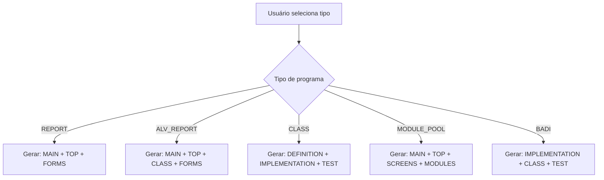

# Brainstorm: Subdivisão Automática de Código ABAP

## 📋 Contexto Atual

### Situação Atual
Atualmente, quando o usuário solicita a geração de código ABAP, a IA retorna todo o código em um único bloco no campo `codigo_principal`, mesmo quando o programa é composto por múltiplos objetos (classes, telas, includes, etc.).

**Exemplo problemático:**
```
Usuário solicita: "Criar um programa ALV com tela de seleção customizada"

IA retorna:
- codigo_principal: [TODO O CÓDIGO JUNTO - 1500 linhas]
  * Tela de seleção
  * Classe de processamento
  * Classe ALV
  * Include de TOP
  * Include de eventos
  * Programa principal
```

### Estrutura Existente
✅ **Já temos:**
```typescript
interface CodigoGerado {
  codigo_principal: string
  codigos_adicionais?: Array<{
    tipo: string
    nome: string
    codigo: string
    descricao?: string
  }>
  // ... outros campos
}
```

✅ **Viewer já preparado:**
- Tabs para código principal e adicionais
- Download individual
- Download completo
- Syntax highlighting

❌ **O que falta:**
- Instruir a IA a usar `codigos_adicionais`
- Definir taxonomia de tipos de código
- Mapear quais tipos de programa geram quais arquivos
- UI para melhor visualização hierárquica

---

## 🎯 Objetivo da Melhoria

### O que queremos
Que a IA retorne código **subdividido** de forma inteligente, seguindo as boas práticas SAP:

**Exemplo desejado:**
```
Usuário solicita: "Criar um programa ALV com tela de seleção customizada"

IA retorna:
{
  "codigo_principal": "REPORT z_vendas_alv. (programa main)",
  "codigos_adicionais": [
    {
      "tipo": "SCREEN",
      "nome": "SCREEN_1000",
      "codigo": "PROCESS BEFORE OUTPUT...",
      "descricao": "Tela de seleção customizada com filtros avançados"
    },
    {
      "tipo": "CLASS",
      "nome": "ZCL_VENDAS_PROCESSOR",
      "codigo": "CLASS zcl_vendas_processor...",
      "descricao": "Classe responsável por processar dados de vendas"
    },
    {
      "tipo": "CLASS",
      "nome": "ZCL_ALV_HANDLER",
      "codigo": "CLASS zcl_alv_handler...",
      "descricao": "Classe para gerenciar eventos do ALV"
    },
    {
      "tipo": "INCLUDE",
      "nome": "Z_VENDAS_ALV_TOP",
      "codigo": "REPORT z_vendas_alv. DATA: ...",
      "descricao": "Declarações globais e tipos"
    },
    {
      "tipo": "INCLUDE",
      "nome": "Z_VENDAS_ALV_F01",
      "codigo": "FORM processar_dados...",
      "descricao": "Formulários e subroutines"
    }
  ]
}
```

---

## 📊 Taxonomia de Tipos de Código

### Tipos Padrão de Artefatos ABAP

```typescript
enum TipoArtefatoABAP {
  // Programas
  MAIN_PROGRAM = 'MAIN_PROGRAM',        // Programa principal
  SUBROUTINE_POOL = 'SUBROUTINE_POOL',  // Pool de subroutines

  // Includes
  INCLUDE_TOP = 'INCLUDE_TOP',          // Declarações globais (TOP)
  INCLUDE_FORMS = 'INCLUDE_FORMS',      // Forms/Subroutines (F01, F02...)
  INCLUDE_MODULES = 'INCLUDE_MODULES',  // Módulos PBO/PAI (O01, I01...)
  INCLUDE_EVENTS = 'INCLUDE_EVENTS',    // Event handlers
  INCLUDE_CLASS = 'INCLUDE_CLASS',      // Definição de classe local

  // Classes
  CLASS_DEFINITION = 'CLASS_DEFINITION',     // Definição de classe
  CLASS_IMPLEMENTATION = 'CLASS_IMPLEMENTATION', // Implementação de classe
  CLASS_LOCAL = 'CLASS_LOCAL',           // Classe local (definition + implementation)

  // Telas e Interfaces
  SCREEN = 'SCREEN',                    // Dynpro/Screen
  SCREEN_LOGIC = 'SCREEN_LOGIC',        // PBO/PAI logic
  SELECTION_SCREEN = 'SELECTION_SCREEN', // Tela de seleção

  // CDS e Views
  CDS_VIEW = 'CDS_VIEW',                // CDS View
  CDS_TABLE_FUNCTION = 'CDS_TABLE_FUNCTION', // CDS Table Function

  // Function Modules
  FUNCTION_GROUP = 'FUNCTION_GROUP',    // Function Group
  FUNCTION_MODULE = 'FUNCTION_MODULE',  // Function Module
  FUNCTION_INCLUDE = 'FUNCTION_INCLUDE', // Include de function group

  // Formulários
  SMARTFORM = 'SMARTFORM',              // Smartform
  SMARTFORM_FUNCTION = 'SMARTFORM_FUNCTION', // FM gerado pelo Smartform
  ADOBE_FORM = 'ADOBE_FORM',            // Adobe Form
  SAPSCRIPT = 'SAPSCRIPT',              // SAPScript

  // Outros
  TYPE_POOL = 'TYPE_POOL',              // Type pool
  INTERFACE = 'INTERFACE',              // Interface
  TABLE_TYPE = 'TABLE_TYPE',            // Tipo de tabela
  STRUCTURE = 'STRUCTURE',              // Estrutura

  // BADIs e Enhancements
  BADI_IMPLEMENTATION = 'BADI_IMPLEMENTATION',
  ENHANCEMENT_IMPLEMENTATION = 'ENHANCEMENT_IMPLEMENTATION',

  // Testes
  UNIT_TEST = 'UNIT_TEST',              // Classe de teste unitário
  TEST_DATA = 'TEST_DATA',              // Dados de teste
}
```

---

## 🗺️ Mapeamento: Tipo de Programa → Artefatos

### REPORT (Relatório Simples)
```
Arquivos gerados:
1. MAIN_PROGRAM: Programa principal
2. INCLUDE_TOP: Declarações (TABLES, DATA, TYPES)
3. INCLUDE_FORMS: Subroutines (se houver)
```

### ALV_REPORT (Relatório ALV)
```
Arquivos gerados:
1. MAIN_PROGRAM: Programa principal com chamada ALV
2. INCLUDE_TOP: Declarações globais
3. CLASS_LOCAL: Classe para eventos ALV (se interativo)
4. INCLUDE_FORMS: Forms de processamento
5. SELECTION_SCREEN: Definição de tela de seleção (se customizada)
```

### INTERACTIVE_REPORT (Relatório Interativo)
```
Arquivos gerados:
1. MAIN_PROGRAM: Programa principal
2. INCLUDE_TOP: Declarações
3. INCLUDE_EVENTS: AT LINE-SELECTION, TOP-OF-PAGE, etc.
4. CLASS_LOCAL: Classe de processamento
5. INCLUDE_FORMS: Subroutines
```

### CLASS (Classe ABAP)
```
Arquivos gerados:
1. CLASS_DEFINITION: Definição da classe (pública)
2. CLASS_IMPLEMENTATION: Implementação da classe
3. UNIT_TEST: Classe de teste (opcional mas recomendado)
4. TEST_DATA: Dados de teste (opcional)
```

### FUNCTION_MODULE
```
Arquivos gerados:
1. FUNCTION_MODULE: Function module principal
2. FUNCTION_INCLUDE: Include top do function group (se novo)
3. FUNCTION_INCLUDE: Include de forms (se necessário)
4. TABLE_TYPE: Definição de tipos de tabela (se customizado)
```

### CDS_VIEW
```
Arquivos gerados:
1. CDS_VIEW: Definição da CDS View principal
2. CDS_VIEW: CDS Views auxiliares (associações)
3. TABLE_TYPE: Tipos estruturados (se necessário)
```

### DIALOG_PROGRAM (Module Pool)
```
Arquivos gerados:
1. MAIN_PROGRAM: Programa principal
2. INCLUDE_TOP: Declarações globais
3. SCREEN: Screen 100 (e outras)
4. SCREEN_LOGIC: PBO/PAI de cada tela
5. INCLUDE_MODULES: Módulos PBO (O01)
6. INCLUDE_MODULES: Módulos PAI (I01)
7. INCLUDE_FORMS: Subroutines
8. CLASS_LOCAL: Classes auxiliares
```

### BADI
```
Arquivos gerados:
1. BADI_IMPLEMENTATION: Implementação da interface
2. CLASS_DEFINITION: Classe de implementação
3. CLASS_IMPLEMENTATION: Métodos implementados
4. UNIT_TEST: Testes da implementação
```

### SMARTFORM
```
Arquivos gerados:
1. SMARTFORM: Definição do formulário (XML-like)
2. SMARTFORM_FUNCTION: Function module gerado
3. MAIN_PROGRAM: Programa de teste/exemplo
4. STRUCTURE: Estruturas de dados customizadas
```

### FIORI_ELEMENTS / RAP
```
Arquivos gerados:
1. CDS_VIEW: Interface View
2. CDS_VIEW: Consumption View
3. CDS_VIEW: Projection View
4. CLASS_DEFINITION: Behavior Implementation
5. CLASS_IMPLEMENTATION: Métodos de behavior
6. METADATA_EXTENSION: Anotações UI
7. SERVICE_DEFINITION: Definição do serviço
8. SERVICE_BINDING: Binding OData
```

### BDC (Batch Data Communication)
```
Arquivos gerados:
1. MAIN_PROGRAM: Programa BDC principal
2. INCLUDE_TOP: Declarações e estruturas
3. CLASS_LOCAL: Classe de processamento BDC
4. INCLUDE_FORMS: Forms para leitura de arquivo
5. INCLUDE_FORMS: Forms para geração de BDC
6. STRUCTURE: Estrutura de dados do arquivo
```

---

## 🔄 Fluxo de Trabalho Proposto

### 1. Análise do Tipo de Programa


### 2. Instrução Inteligente para IA

**Prompt Enhancement:**
```typescript
const promptSubdivisao = `
## SUBDIVISÃO INTELIGENTE DE CÓDIGO

Baseado no tipo de programa (${tipo_programa}), você deve subdividir o código em múltiplos artefatos:

### Para ${tipo_programa}:
${getArquivosEsperados(tipo_programa)}

### REGRAS DE SUBDIVISÃO:

1. **codigo_principal**: Sempre o arquivo "main" ou mais importante
   - REPORT: O programa principal
   - CLASS: A definição da classe
   - CDS_VIEW: A view principal
   - FUNCTION: O function module

2. **codigos_adicionais**: Todos os outros artefatos necessários
   - Cada arquivo separado logicamente
   - Nome seguindo convenção SAP (Z*, Y*)
   - Descrição clara do propósito

### EXEMPLO DE RETORNO:
{
  "tipo": "codigo",
  "codigo_principal": "REPORT zrep_vendas...",
  "codigos_adicionais": [
    {
      "tipo": "INCLUDE_TOP",
      "nome": "ZREP_VENDAS_TOP",
      "codigo": "* Declarações globais\\nTABLES: vbrk, vbrp...",
      "descricao": "Include com declarações globais do programa"
    },
    {
      "tipo": "CLASS_LOCAL",
      "nome": "LCL_PROCESSOR",
      "codigo": "CLASS lcl_processor DEFINITION...\\nENDCLASS.\\n\\nCLASS lcl_processor IMPLEMENTATION...\\nENDCLASS.",
      "descricao": "Classe local para processamento de dados"
    }
  ]
}

### IMPORTANTE:
- Subdivida logicamente seguindo boas práticas SAP
- Cada arquivo deve ser independente quando possível
- Mantenha coesão: código relacionado no mesmo arquivo
- Adicione comentários explicando a relação entre arquivos
`
```

### 3. Response Processing

```typescript
interface ProcessedResponse {
  estrutura: {
    principal: {
      tipo: TipoArtefatoABAP
      nome: string
      linhas: number
      dependencias: string[]
    }
    adicionais: Array<{
      tipo: TipoArtefatoABAP
      nome: string
      linhas: number
      dependenciasDe: string[]
      usadoPor: string[]
    }>
  }
  grafo: {
    nodes: Array<{ id: string, label: string, tipo: string }>
    edges: Array<{ from: string, to: string, tipo: 'inclui' | 'usa' | 'implementa' }>
  }
}
```

---

## 🎨 UI/UX Melhorada

### Visualização Atual (Tabs)
```
[ Código Principal ] [ Adicionais (5) ] [ Documentação ]
```

### Visualização Proposta - Opção 1: Tree View
```
📦 ZREP_VENDAS_ALV
├── 📄 ZREP_VENDAS_ALV (MAIN_PROGRAM) ⭐ Principal
├── 📋 Includes
│   ├── 📄 ZREP_VENDAS_TOP (INCLUDE_TOP)
│   ├── 📄 ZREP_VENDAS_F01 (INCLUDE_FORMS)
│   └── 📄 ZREP_VENDAS_E01 (INCLUDE_EVENTS)
├── 🎨 Classes
│   ├── 📄 LCL_DATA_PROCESSOR (CLASS_LOCAL)
│   └── 📄 LCL_ALV_HANDLER (CLASS_LOCAL)
└── 📱 Screens
    └── 📄 SCREEN_1000 (SELECTION_SCREEN)
```

### Visualização Proposta - Opção 2: Cards Hierárquicos
```
┌─────────────────────────────────────────┐
│ 📦 ZREP_VENDAS_ALV                      │
│ Relatório ALV de Vendas                 │
│ ⭐ Programa Principal (250 linhas)      │
│                                         │
│ [Visualizar] [Copiar] [Download]       │
└─────────────────────────────────────────┘

┌──────────────────┐ ┌──────────────────┐
│ 📋 Includes (3)  │ │ 🎨 Classes (2)   │
├──────────────────┤ ├──────────────────┤
│ • TOP            │ │ • DATA_PROCESSOR │
│ • F01 (Forms)    │ │ • ALV_HANDLER    │
│ • E01 (Events)   │ └──────────────────┘
└──────────────────┘

┌──────────────────┐
│ 📱 Screens (1)   │
├──────────────────┤
│ • SCREEN_1000    │
└──────────────────┘
```

### Visualização Proposta - Opção 3: Abas Hierárquicas
```
[ 📦 Visão Geral ] [ 📄 Arquivos (7) ] [ 🔗 Dependências ] [ 📚 Docs ]

Aba "Arquivos":
┌─────────────────────────────────────────────────────┐
│ Filtrar por tipo: [ Todos ▾ ]                       │
├─────────────────────────────────────────────────────┤
│                                                     │
│ ⭐ ZREP_VENDAS_ALV (MAIN_PROGRAM)                   │
│    Programa principal do relatório                  │
│    250 linhas | Usa: TOP, F01, LCL_DATA_PROCESSOR  │
│    [👁️ Visualizar] [📋 Copiar] [💾 Download]        │
│                                                     │
│ 📋 ZREP_VENDAS_TOP (INCLUDE_TOP)                    │
│    Declarações globais e tipos                      │
│    80 linhas | Usado por: MAIN_PROGRAM             │
│    [👁️ Visualizar] [📋 Copiar] [💾 Download]        │
│                                                     │
│ [... outros arquivos ...]                           │
└─────────────────────────────────────────────────────┘

Aba "Dependências":
┌─────────────────────────────────────────────────────┐
│                                                     │
│         MAIN_PROGRAM                                │
│         /     |     \                               │
│       TOP    F01   LCL_PROCESSOR                    │
│                     |                               │
│                LCL_ALV_HANDLER                      │
│                                                     │
│ [Download como imagem] [Exportar Mermaid]          │
└─────────────────────────────────────────────────────┘
```

### Componente de Código Individual
```tsx
interface CodigoCardProps {
  tipo: TipoArtefatoABAP
  nome: string
  codigo: string
  descricao: string
  linhas: number
  dependencias?: string[]
  usadoPor?: string[]
  isPrincipal?: boolean
}

<CodigoCard>
  <Header>
    <Icon tipo={tipo} />
    <Title>{nome}</Title>
    {isPrincipal && <Badge>Principal</Badge>}
  </Header>

  <Description>{descricao}</Description>

  <Stats>
    <Stat icon={<FileCode />}>{linhas} linhas</Stat>
    {dependencias && (
      <Stat icon={<Link />}>
        Usa: {dependencias.join(', ')}
      </Stat>
    )}
  </Stats>

  <Actions>
    <Button onClick={visualizar}>
      <Eye /> Visualizar
    </Button>
    <Button onClick={copiar}>
      <Copy /> Copiar
    </Button>
    <Button onClick={download}>
      <Download /> Download
    </Button>
  </Actions>

  {expanded && (
    <CodeBlock>
      <SyntaxHighlighter>{codigo}</SyntaxHighlighter>
    </CodeBlock>
  )}
</CodigoCard>
```

---

## 🛠️ Mudanças Necessárias

### 1. Types (`types/abap.ts`)

```typescript
// ADICIONAR novo enum
export enum TipoArtefatoABAP {
  MAIN_PROGRAM = 'MAIN_PROGRAM',
  INCLUDE_TOP = 'INCLUDE_TOP',
  INCLUDE_FORMS = 'INCLUDE_FORMS',
  CLASS_DEFINITION = 'CLASS_DEFINITION',
  CLASS_IMPLEMENTATION = 'CLASS_IMPLEMENTATION',
  CLASS_LOCAL = 'CLASS_LOCAL',
  SCREEN = 'SCREEN',
  SCREEN_LOGIC = 'SCREEN_LOGIC',
  CDS_VIEW = 'CDS_VIEW',
  FUNCTION_MODULE = 'FUNCTION_MODULE',
  BADI_IMPLEMENTATION = 'BADI_IMPLEMENTATION',
  UNIT_TEST = 'UNIT_TEST',
  // ... outros
}

// MODIFICAR interface existente
export interface CodigoAdicional {
  tipo: TipoArtefatoABAP  // <-- Era string, agora é enum
  nome: string
  codigo: string
  descricao?: string
  // ADICIONAR novos campos:
  linhas?: number
  tamanho_kb?: number
  dependencias?: string[]
  usado_por?: string[]
  ordem_criacao?: number  // Para saber em que ordem criar no SAP
}

// ADICIONAR nova interface
export interface EstruturaCodigo {
  tipo_programa: TipoProgramaABAP
  arvore_arquivos: ArquivoNode[]
  grafo_dependencias: GrafoDependencias
  ordem_criacao: string[]  // Ordem em que objetos devem ser criados
  instrucoes_instalacao: string[]
}

interface ArquivoNode {
  id: string
  nome: string
  tipo: TipoArtefatoABAP
  isPrincipal: boolean
  children?: ArquivoNode[]
}
```

### 2. Prompts (`lib/prompts/abapprompt.ts`)

```typescript
// ADICIONAR função helper
function getArtefatosEsperados(tipo: TipoProgramaABAP): string {
  const mapeamento: Record<TipoProgramaABAP, Array<{tipo: TipoArtefatoABAP, descricao: string}>> = {
    REPORT: [
      { tipo: 'MAIN_PROGRAM', descricao: 'Programa principal' },
      { tipo: 'INCLUDE_TOP', descricao: 'Declarações globais (opcional)' },
      { tipo: 'INCLUDE_FORMS', descricao: 'Subroutines (se necessário)' }
    ],
    ALV_REPORT: [
      { tipo: 'MAIN_PROGRAM', descricao: 'Programa principal com ALV' },
      { tipo: 'INCLUDE_TOP', descricao: 'Declarações e estruturas' },
      { tipo: 'CLASS_LOCAL', descricao: 'Classe para eventos ALV' },
      { tipo: 'INCLUDE_FORMS', descricao: 'Forms de processamento' }
    ],
    CLASS: [
      { tipo: 'CLASS_DEFINITION', descricao: 'Definição pública da classe' },
      { tipo: 'CLASS_IMPLEMENTATION', descricao: 'Implementação dos métodos' },
      { tipo: 'UNIT_TEST', descricao: 'Classe de teste unitário (recomendado)' }
    ],
    // ... outros tipos
  }

  return JSON.stringify(mapeamento[tipo], null, 2)
}

// MODIFICAR prompt principal
export function gerarPromptABAP(formData: AbapFormData): string {
  const artefatosEsperados = getArtefatosEsperados(formData.tipo_programa)

  return `
  [... prompt existente ...]

  ## SUBDIVISÃO INTELIGENTE DE CÓDIGO

  Para programas do tipo ${formData.tipo_programa}, você deve subdividir em:

  ${artefatosEsperados}

  ### REGRAS:
  1. Coloque o arquivo principal em "codigo_principal"
  2. Coloque todos os outros em "codigos_adicionais"
  3. Cada arquivo deve ter:
     - tipo: (use o enum correto)
     - nome: (seguindo convenção SAP)
     - codigo: (código completo e funcional)
     - descricao: (explicação clara do propósito)

  ### EXEMPLO:
  {
    "tipo": "codigo",
    "codigo_principal": "...",
    "codigos_adicionais": [...]
  }
  `
}
```

### 3. Componente Viewer (`components/abap/CodigoGeradoViewer.tsx`)

```typescript
// SUBSTITUIR tabs simples por uma das visualizações propostas

// Opção 1: Tree View
<TreeView estrutura={estrutura} />

// Opção 2: Cards Hierárquicos
<div className="grid grid-cols-3 gap-4">
  <PrincipalCard codigo={codigo.codigo_principal} />
  <CategoriasGrid categorias={agruparPorCategoria(codigo.codigos_adicionais)} />
</div>

// Opção 3: Tabs Melhoradas
<Tabs>
  <Tab value="overview">
    <VisaoGeral estrutura={estrutura} />
  </Tab>
  <Tab value="files">
    <ListaArquivos arquivos={todosArquivos} />
  </Tab>
  <Tab value="deps">
    <GrafoDependencias grafo={grafo} />
  </Tab>
</Tabs>
```

### 4. Novo Componente: Grafo de Dependências

```typescript
// components/abap/GrafoDependencias.tsx
import Mermaid from 'react-mermaid2'

export function GrafoDependencias({ arquivos }) {
  const mermaidCode = gerarMermaidCode(arquivos)

  return (
    <div className="w-full">
      <Mermaid chart={mermaidCode} />
      <Button onClick={downloadImage}>Download Diagrama</Button>
      <Button onClick={exportMermaid}>Exportar Mermaid</Button>
    </div>
  )
}

function gerarMermaidCode(arquivos): string {
  return `
  graph TD
    MAIN[ZREP_VENDAS<br/>MAIN_PROGRAM]
    TOP[ZREP_VENDAS_TOP<br/>INCLUDE_TOP]
    F01[ZREP_VENDAS_F01<br/>INCLUDE_FORMS]
    CLS1[LCL_PROCESSOR<br/>CLASS_LOCAL]

    MAIN -->|inclui| TOP
    MAIN -->|inclui| F01
    MAIN -->|usa| CLS1
    CLS1 -->|usa| F01
  `
}
```

### 5. Helpers Utilitários

```typescript
// lib/utils/codigo-helpers.ts

export function agruparPorCategoria(codigos: CodigoAdicional[]) {
  return {
    includes: codigos.filter(c => c.tipo.includes('INCLUDE')),
    classes: codigos.filter(c => c.tipo.includes('CLASS')),
    screens: codigos.filter(c => c.tipo.includes('SCREEN')),
    outros: codigos.filter(c => !['INCLUDE', 'CLASS', 'SCREEN'].some(t => c.tipo.includes(t)))
  }
}

export function ordenarPorDependencia(codigos: CodigoAdicional[]): CodigoAdicional[] {
  // Algoritmo de topological sort
  // Garante que dependências sejam criadas primeiro
}

export function gerarInstrucoesInstalacao(estrutura: EstruturaCodigo): string[] {
  return [
    '1. Criar programa principal via SE38',
    '2. Criar includes via SE38',
    '3. Copiar código de cada include',
    '4. Ativar includes',
    '5. Copiar código principal',
    '6. Ativar programa',
    '7. Testar via SE38'
  ]
}

export function calcularEstatisticas(codigo: CodigoGerado) {
  return {
    total_arquivos: 1 + (codigo.codigos_adicionais?.length || 0),
    total_linhas: contarLinhas(codigo.codigo_principal) +
                  (codigo.codigos_adicionais?.reduce((sum, c) => sum + contarLinhas(c.codigo), 0) || 0),
    tipos_unicos: [...new Set(codigo.codigos_adicionais?.map(c => c.tipo))],
    complexidade: calcularComplexidade(codigo)
  }
}
```

---

## 📝 Exemplo Prático Completo

### Input do Usuário
```
Tipo: ALV_REPORT
Nome: ZREP_VENDAS_REGIONAL
Objetivo: Relatório de vendas por região com drill-down
Tabelas: VBRK, VBRP, KNA1
```

### Output Esperado da IA

```json
{
  "tipo": "codigo",
  "codigo_principal": "*&---------------------------------------------------------------------*\n*& Report ZREP_VENDAS_REGIONAL\n*&---------------------------------------------------------------------*\n*& Relatório de vendas por região com drill-down\n*&---------------------------------------------------------------------*\nREPORT zrep_vendas_regional.\n\nINCLUDE zrep_vendas_regional_top.\nINCLUDE zrep_vendas_regional_f01.\n\nSTART-OF-SELECTION.\n  PERFORM processar_dados.\n  PERFORM exibir_alv.\n",

  "codigos_adicionais": [
    {
      "tipo": "INCLUDE_TOP",
      "nome": "ZREP_VENDAS_REGIONAL_TOP",
      "codigo": "*&---------------------------------------------------------------------*\n*& Include ZREP_VENDAS_REGIONAL_TOP\n*&---------------------------------------------------------------------*\n*& Declarações globais e definições de tipo\n*&---------------------------------------------------------------------*\n\nTABLES: vbrk, vbrp, kna1.\n\nTYPES: BEGIN OF ty_vendas,\n  vbeln TYPE vbrk-vbeln,\n  fkdat TYPE vbrk-fkdat,\n  kunag TYPE vbrk-kunag,\n  name1 TYPE kna1-name1,\n  netwr TYPE vbrp-netwr,\n  regio TYPE kna1-regio,\nEND OF ty_vendas.\n\nDATA: gt_vendas TYPE TABLE OF ty_vendas,\n      go_alv TYPE REF TO cl_gui_alv_grid.\n\nSELECT-OPTIONS: s_fkdat FOR vbrk-fkdat OBLIGATORY,\n                s_regio FOR kna1-regio.",
      "descricao": "Include com todas as declarações globais, tipos de dados e tela de seleção",
      "linhas": 25,
      "usado_por": ["ZREP_VENDAS_REGIONAL"]
    },
    {
      "tipo": "INCLUDE_FORMS",
      "nome": "ZREP_VENDAS_REGIONAL_F01",
      "codigo": "*&---------------------------------------------------------------------*\n*& Include ZREP_VENDAS_REGIONAL_F01\n*&---------------------------------------------------------------------*\n*& Forms e subroutines\n*&---------------------------------------------------------------------*\n\nFORM processar_dados.\n  SELECT vbrk~vbeln vbrk~fkdat vbrk~kunag\n         kna1~name1 kna1~regio\n         SUM( vbrp~netwr ) AS netwr\n    FROM vbrk\n    INNER JOIN vbrp ON vbrk~vbeln = vbrp~vbeln\n    INNER JOIN kna1 ON vbrk~kunag = kna1~kunnr\n    INTO TABLE @gt_vendas\n    WHERE vbrk~fkdat IN @s_fkdat\n      AND kna1~regio IN @s_regio\n    GROUP BY vbrk~vbeln, vbrk~fkdat, vbrk~kunag, kna1~name1, kna1~regio.\n\n  IF sy-subrc <> 0.\n    MESSAGE 'Nenhum dado encontrado' TYPE 'I'.\n  ENDIF.\nENDFORM.\n\nFORM exibir_alv.\n  DATA: lo_alv TYPE REF TO lcl_alv_handler.\n  CREATE OBJECT lo_alv.\n  lo_alv->display( gt_vendas ).\nENDFORM.",
      "descricao": "Formulários para processamento de dados e exibição do ALV",
      "linhas": 28,
      "dependencias": ["ZREP_VENDAS_REGIONAL_TOP"],
      "usado_por": ["ZREP_VENDAS_REGIONAL"]
    },
    {
      "tipo": "CLASS_LOCAL",
      "nome": "LCL_ALV_HANDLER",
      "codigo": "*&---------------------------------------------------------------------*\n*& Classe Local LCL_ALV_HANDLER\n*&---------------------------------------------------------------------*\n*& Classe para gerenciar eventos do ALV\n*&---------------------------------------------------------------------*\n\nCLASS lcl_alv_handler DEFINITION.\n  PUBLIC SECTION.\n    METHODS:\n      display IMPORTING it_data TYPE ty_vendas_table,\n      on_double_click FOR EVENT double_click OF cl_gui_alv_grid\n        IMPORTING e_row e_column.\n  PRIVATE SECTION.\n    DATA: mo_alv TYPE REF TO cl_gui_alv_grid.\nENDCLASS.\n\nCLASS lcl_alv_handler IMPLEMENTATION.\n  METHOD display.\n    \" Criar container e ALV\n    DATA: lo_container TYPE REF TO cl_gui_custom_container.\n    \n    CREATE OBJECT lo_container\n      EXPORTING container_name = 'CONTAINER'.\n    \n    CREATE OBJECT mo_alv\n      EXPORTING i_parent = lo_container.\n    \n    \" Configurar eventos\n    SET HANDLER me->on_double_click FOR mo_alv.\n    \n    \" Exibir dados\n    mo_alv->set_table_for_first_display(\n      EXPORTING i_structure_name = 'TY_VENDAS'\n      CHANGING it_outtab = it_data ).\n  ENDMETHOD.\n  \n  METHOD on_double_click.\n    \" Implementar drill-down aqui\n    MESSAGE 'Drill-down em desenvolvimento' TYPE 'I'.\n  ENDMETHOD.\nENDCLASS.",
      "descricao": "Classe local para gerenciar o ALV e eventos de drill-down",
      "linhas": 42,
      "dependencias": ["ZREP_VENDAS_REGIONAL_TOP"],
      "usado_por": ["ZREP_VENDAS_REGIONAL_F01"]
    },
    {
      "tipo": "UNIT_TEST",
      "nome": "LTC_VENDAS_REGIONAL",
      "codigo": "*&---------------------------------------------------------------------*\n*& Classe de Teste LTC_VENDAS_REGIONAL\n*&---------------------------------------------------------------------*\n\nCLASS ltc_vendas_regional DEFINITION FOR TESTING\n  DURATION SHORT\n  RISK LEVEL HARMLESS.\n  \n  PRIVATE SECTION.\n    METHODS:\n      test_processar_dados FOR TESTING,\n      setup,\n      teardown.\nENDCLASS.\n\nCLASS ltc_vendas_regional IMPLEMENTATION.\n  METHOD setup.\n    \" Preparar dados de teste\n  ENDMETHOD.\n  \n  METHOD test_processar_dados.\n    \" Testar processamento\n    cl_abap_unit_assert=>assert_not_initial(\n      act = gt_vendas\n      msg = 'Tabela de vendas deve ser preenchida' ).\n  ENDMETHOD.\n  \n  METHOD teardown.\n    \" Limpar dados de teste\n    CLEAR gt_vendas.\n  ENDMETHOD.\nENDCLASS.",
      "descricao": "Testes unitários para validar o processamento de dados",
      "linhas": 32,
      "dependencias": ["ZREP_VENDAS_REGIONAL_TOP"]
    }
  ],

  "documentacao": {
    "descricao_geral": "Relatório ALV interativo de vendas por região",
    "como_usar": "Execute via SE38, preencha período e região, visualize resultados em ALV",
    "estrutura_arquivos": [
      "ZREP_VENDAS_REGIONAL (Principal)",
      "├── ZREP_VENDAS_REGIONAL_TOP (Includes)",
      "├── ZREP_VENDAS_REGIONAL_F01",
      "├── LCL_ALV_HANDLER (Classe)",
      "└── LTC_VENDAS_REGIONAL (Testes)"
    ],
    "ordem_instalacao": [
      "1. Criar programa via SE38: ZREP_VENDAS_REGIONAL",
      "2. Criar include TOP via SE38",
      "3. Copiar código do include TOP e ativar",
      "4. Criar include F01 via SE38",
      "5. Copiar código do include F01 e ativar",
      "6. Copiar código principal do programa",
      "7. Copiar classe local LCL_ALV_HANDLER no programa principal",
      "8. Copiar classe de teste (opcional)",
      "9. Ativar programa completo",
      "10. Testar via SE38"
    ]
  }
}
```

### Visualização na UI

```
┌─────────────────────────────────────────────────────────────┐
│ 📦 ZREP_VENDAS_REGIONAL                                     │
│ Relatório ALV de Vendas por Região                          │
│                                                             │
│ 📊 Estatísticas:                                            │
│ • 5 arquivos  • 127 linhas  • 3 dependências               │
│                                                             │
│ [📥 Download Tudo] [📋 Copiar Tudo] [📖 Ver Instruções]    │
└─────────────────────────────────────────────────────────────┘

┌────────────────────────────────┐
│ ⭐ Arquivo Principal           │
├────────────────────────────────┤
│ ZREP_VENDAS_REGIONAL           │
│ MAIN_PROGRAM | 25 linhas      │
│ Programa principal com includes│
│ [👁️] [📋] [💾]                 │
└────────────────────────────────┘

┌────────────────────────┬────────────────────────┐
│ 📋 Includes (2)        │ 🎨 Classes (2)         │
├────────────────────────┼────────────────────────┤
│ • TOP (25 linhas)      │ • LCL_ALV_HANDLER      │
│   Declarações          │   (42 linhas)          │
│   [👁️] [📋] [💾]       │   ALV e eventos        │
│                        │   [👁️] [📋] [💾]       │
│ • F01 (28 linhas)      │                        │
│   Forms                │ • LTC_VENDAS (32 l.)   │
│   [👁️] [📋] [💾]       │   Testes unitários     │
│                        │   [👁️] [📋] [💾]       │
└────────────────────────┴────────────────────────┘

Grafo de Dependências:
        [MAIN]
        /    \
      TOP   F01
             |
        LCL_ALV_HANDLER
```

---

## 🎯 Benefícios da Implementação

### Para o Desenvolvedor
✅ **Organização:** Código modular e organizado
✅ **Reusabilidade:** Classes e includes podem ser reutilizados
✅ **Manutenibilidade:** Mais fácil manter código separado
✅ **Compreensão:** Estrutura clara e documentada
✅ **Versionamento:** Controle granular de mudanças

### Para a Qualidade do Código
✅ **Boas Práticas:** Segue padrões SAP
✅ **Testabilidade:** Testes separados e focados
✅ **Performance:** Código otimizado e modular
✅ **Segurança:** Melhor validação e separação de concerns

### Para o Projeto
✅ **Produtividade:** Download e uso mais rápido
✅ **Documentação:** Estrutura auto-documentada
✅ **Onboarding:** Novos devs entendem melhor
✅ **Escalabilidade:** Fácil adicionar novos módulos

---

## 🚀 Roadmap de Implementação

### Fase 1: Foundation (1-2 dias)
- [ ] Criar enum `TipoArtefatoABAP`
- [ ] Adicionar campos em `CodigoAdicional`
- [ ] Criar helper `getArtefatosEsperados()`
- [ ] Testar com 1 tipo de programa (REPORT)

### Fase 2: Prompts (2-3 dias)
- [ ] Atualizar prompt ABAP com instruções de subdivisão
- [ ] Mapear todos os tipos de programa → artefatos
- [ ] Adicionar exemplos no prompt
- [ ] Testar com Groq, Gemini, OpenAI, Anthropic

### Fase 3: UI Básica (2-3 dias)
- [ ] Melhorar visualização de códigos adicionais
- [ ] Adicionar agrupamento por categoria
- [ ] Implementar download individual melhorado
- [ ] Adicionar estatísticas

### Fase 4: UI Avançada (3-4 dias)
- [ ] Implementar Tree View ou Cards Hierárquicos
- [ ] Criar componente de Grafo de Dependências
- [ ] Adicionar instruções de instalação
- [ ] Melhorar UX de cópia/download

### Fase 5: Polimento (1-2 dias)
- [ ] Testes com diferentes tipos de programa
- [ ] Ajuste fino dos prompts
- [ ] Documentação
- [ ] Tutorial para usuários

---

## 💡 Considerações Finais

### Desafios Técnicos
1. **IA pode não seguir:** Precisará de iteração nos prompts
2. **Validação complexa:** Verificar se subdivisão faz sentido
3. **Performance:** Processar múltiplos arquivos grandes
4. **Dependências circulares:** Detectar e evitar

### Alternativas Consideradas
1. **Pós-processamento:** Subdividir código já gerado
   - ❌ Complexo de implementar
   - ❌ Menos preciso

2. **Duas chamadas de IA:** Uma para planejar, outra para gerar
   - ❌ Mais lento
   - ❌ Mais tokens

3. **Template-based:** Usar templates SAP padrão
   - ❌ Menos flexível
   - ✅ Mais previsível

### Recomendação
✅ **Implementar via Prompt Engineering**
- Instruir IA diretamente
- Iterar baseado em resultados
- Adicionar validações pós-geração

---

## 📚 Referências

### SAP Standards
- [ABAP Programming Guidelines](https://help.sap.com/docs)
- [Modularization Techniques](https://help.sap.com/docs)
- [Include Programs](https://help.sap.com/docs)

### Best Practices
- Clean ABAP by SAP
- ABAP Code Inspector Rules
- SAP Code Review Guidelines

---

**Documento criado em:** 01/12/2025
**Última atualização:** 01/12/2025
**Status:** 💡 Brainstorm - Não implementado
**Prioridade:** 🟡 Média (melhoria futura)
